# Agent delegation benchmark handbook

This is the canonical, procedural reproduction and interpretation reference
for future coding agents. Read it before changing a fixture, running a model,
or interpreting a score. Historical evidence is immutable. Current local CLI
behaviour must be rediscovered because model IDs, permissions, and syntax are
time-sensitive.

## 1. Purpose and research question

The benchmark answers a workflow question, not “which company has the best
LLM?”: **which subscription-authenticated coding agents/models are useful for
specific delegation roles in this research/software workflow?** The six small,
synthetic workloads are Python/data analysis, scientific diagnostic plotting,
debugging an existing package, repository/code review, scientific writing, and
Markdown/Pandoc/PDF generation.

The exercises are deliberately small. They limit quota/token consumption,
permit direct artifact inspection, resemble repeated practical work, and expose
behaviour such as validation, over-engineering, and epistemic calibration that
a final-answer-only leaderboard misses. Provider usage fields are retained in
their native form; they are not normalized. Any reported dollar value is an
API-equivalent/provider metric, **not** a subscription charge.

## 2. Experimental philosophy

Every controlled attempt follows these rules and the reason for each is stated
explicitly:

- **Same frozen task, fixture, and evaluator.** This prevents a later agent
  receiving easier instructions or different evidence.
- **Independent copied workspaces.** One contestant cannot learn from another
  output; each begins with byte-identical public input.
- **Private ground truth where relevant.** Debug/review manifests remain under
  `private_admin/` and are never copied into a contestant workspace.
- **Explicit models and effort.** Defaults change; pinning makes an attempt
  interpretable.
- **One attempt.** A wrong/incomplete answer is performance evidence. Repair
  only a demonstrated harness/permission/configuration fault; preserve the
  original invalid run and use a fresh label.
- **Harness failure is not model failure.** A rejected argv, blocked required
  write, authentication failure, or malformed adapter cannot become a zero.
- **Objective and blind evaluation are separate.** Use exact machine checks
  where meaningful; hide identity before a prose/PDF/plot visual review and
  reveal it only after review scores are frozen.
- **Raw evidence is permanent.** Retain command metadata, stdout/stderr,
  `execution.json`, changed-file snapshots, evaluator output, and blind maps.
- **Composite evidence is permitted only with provenance.** A resumed attempt
  may be combined when fixture/prompt hashes and agent configuration match, and
  its source run label is made explicit.

## 3. Repository architecture and lifecycle

| Location | Responsibility |
|---|---|
| `benchmark/` | task registry, adapters, runner, lock verification, preflight, evaluation |
| `fixtures/` | public starting material copied into each workspace |
| `tasks/prompts/` | frozen contestant prompts |
| `tests/` | harness and delegation unit tests; mocked subprocesses only |
| `private_admin/manifests/` | hidden seeded-issue ground truth; administrator-only |
| `runs/` | immutable execution evidence, objective results, blind copies, reports |
| `fixtures.lock.json` | SHA-256 lock for fixtures/prompts |
| `benchmark_methodology.json` | machine-readable methodology/version/hash registry |
| `README.md` / `RUN_HISTORY.md` | short operational overview and historical incident record |

Within a completed contestant directory, `workspace/` is its supplied and
resulting filesystem; `meta/prompt.md` preserves its prompt; `result/` holds
`execution.json`, `stdout.txt`, `stderr.txt`, evaluation output, and possible
last-message output. `run.json` preserves run-level order, tier, scope, and
configuration. Blind copies have opaque names and `blind_map.json` is private.

```mermaid
flowchart LR
  A[Frozen prompt + fixture lock] --> B[Prepare isolated workspace]
  B --> C[Adapter constructs argv]
  C --> D[Contestant CLI]
  D --> E[Workspace + stdout/stderr + execution metadata]
  E --> F[Objective evaluator]
  F --> G[Anonymous blind copy]
  G --> H[Human/LLM blind review]
  H --> I[Freeze scores then reveal identity]
  I --> J[Qualified aggregate interpretation]
```

## 4. Reproduce on a new computer

Do not copy an old command line blindly. On Ubuntu/Linux, install a supported
Python 3.10+ and build tools with the platform package manager; create a
venv/conda environment, then install the project (`pip install -e .` is
appropriate) and Python dependencies such as matplotlib. Install Pandoc and a
LaTeX backend (`pdflatex`; usually TeX Live). A PDF/image toolchain may also
need Poppler/ImageMagick for inspection/conversion. On macOS, the equivalent
tools are commonly installed with Homebrew; `pdflatex` normally comes from
MacTeX/BasicTeX. Verify `python3`, `pandoc`, and `pdflatex` are on `PATH`.

1. Clone or securely copy the repository; do not copy another machine's
   credentials or private manifests into a delegate scope.
2. Create/activate Python environment and install requirements/project.
3. Install Codex CLI, Claude Code, and the Antigravity/Gemini frontend using
   their current official installation instructions.
4. Authenticate each CLI through the intended subscription/account mechanism.
   Authentication is separate from fixture validation and must not be printed
   into logs.
5. Record local versions: `codex --version`, `claude --version`, `agy --version`.
   Inspect `codex exec --help`, `claude --help`, `agy --help`, and `agy models`.
   Discover account-visible Codex models from local CLI state where available.
6. Run `python -m unittest discover -s tests -q` and
   `python -m benchmark.runner check`.
7. Run a **no-model** preflight for the selected tier, e.g.
   `python -m benchmark.runner preflight --tier tier-a-medium --agents codex,claude,agy --tasks research_python`.
8. Inspect the redacted argv templates. Only after every check passes and the
   user approves the model/tier may a paid contestant be launched.

Model IDs, syntax, models exposed by subscription accounts, effort settings,
and sandbox semantics may differ from the historical record. Treat local help
as the authority for a new run.

## 5. Historical controlled configurations

These are **matched practical operating tiers**, not matched-compute claims:

| Study | Codex | Claude | Antigravity |
|---|---|---|---|
| Tier A everyday/medium | `gpt-5.6-terra`, medium | `claude-sonnet-5`, medium | `gemini-3.1-pro-low` |
| Tier B cheap/high-throughput | `gpt-5.6-luna`, medium | `claude-haiku-4-5-20251001`, medium | `gemini-3.7-flash-medium` |
| Selected crossover | not rerun | not rerun | `gemini-3.7-flash-medium` on scientific writing and Pandoc/PDF |

The selected crossover compared Flash against existing Tier A evidence only.
It did not convert Tier A/B into equal-compute tiers.

### Historical benchmark configuration versus current recommendation

The table above is a historical record of what was actually run. It must not
be silently rewritten when a CLI changes. **Current operational recommendation**
from the completed evidence is: Terra/medium as primary owner, Sonnet/medium
for substantial implementation/build/writing, Flash/medium as the default
Antigravity delegate, Haiku/medium for routine quota-preserving Claude work,
and Luna/medium only through an appropriate Codex-native subagent surface.
Before any future invocation, inspect current local CLI help/model availability
and update a *new* run's metadata rather than claiming it was historical.

## 6. Incident and failure history

Use this section to classify historical artifacts correctly.

| Incident | Symptom and root cause | Classification / inference | Repair and prevention |
|---|---|---|---|
| Codex flag failure | Early adapter placed unsupported `--ask-for-approval`; a later command combined `--sandbox workspace-write` with `--approve-for-me`, which Codex rejected before session start. | Harness failure; no model performance inference. | Use documented `codex exec --ephemeral --skip-git-repo-check --sandbox workspace-write --cd … --json …` without approval convenience flags; test argv against help. |
| Unsupported Codex model | Requested `gpt-5.6` was unavailable to the authenticated ChatGPT account. Local discovery exposed `gpt-5.6-sol`, `gpt-5.6-terra`, and `gpt-5.6-luna`. | Model/account compatibility failure, not task performance. | Model family name is not a valid CLI ID. Discover account-local IDs and make preflight reject a non-visible requested model. |
| Antigravity ordering | Later flags were effectively swallowed into `-p` prompt context; it discussed `--output-format` rather than receiving the task. | Harness failure. | Build subprocess argv lists, put every option before final `-p <PROMPT>`, and test prompt atomicity. |
| Claude Write denial | `--permission-mode auto` did not preapprove Write for unattended Haiku; intended code appeared but approval blocked file creation. | Permission/harness failure, not a zero. | Explicitly allow required file tools for implementation tasks; absence of a required deliverable after a denial is blocking. |
| Claude `python` versus `python3` | Allowlist granted only `Bash(python3 *)`; Haiku chose `python analysis.py`, which was denied. | Permission/harness failure because verification could not complete. | Permit realistic equivalent forms: `Bash(python *)`, `Bash(python3 *)`, and task-required `Bash(pytest *)`; never replace with unrestricted Bash. |
| Named-tier subset | `--tier tier-b-cheap --agents agy` initially failed because tier membership was treated as mandatory execution. | Runner design defect, no contestant launched. | A tier is a canonical config mapping; any non-empty subset is valid and records tier identity, available agents, and requested agents. |
| External interruption | Haiku diagnostic plot left files in `tier-b-controlled-002`, but execution/evaluator evidence was incomplete. | External interruption; neither model nor harness failure. | Preserve and mark invalid; exclude score/time/usage; continue missing work in a fresh label without rerunning valid attempts. |
| Repository-review defect | Hidden manifest alleged an overdraft bug that fixture `withdraw` did not exhibit. Strict read-only checking also treated generated bytecode as an edit. | Invalid fixture/evaluator for substantive review ranking. | Exclude `repository_review` v1 from aggregate interpretation. Create `repository_review_v2`; never silently mutate old ground truth. |
| Codex global skill access | Tier A traces show reads of global skill files outside the assigned workspace. No private manifest or competitor output was read. | Isolation/fairness caveat, not evidence of contamination. | Record it; do not claim strict workspace-only read isolation. Future versions must control skills/system context explicitly. |

The `first-*` labels are PILOT / HARNESS VALIDATION only and are excluded from
controlled aggregate interpretation. `RUN_HISTORY.md` and completed report
files are the audit trail.

## 7. Validity taxonomy

| Status | Meaning | Aggregate eligibility |
|---|---|---|
| VALID CORRECT | CLI completed; outputs/evidence exist; evaluator finds correct result | yes |
| VALID INCORRECT | CLI completed normally but answer is incomplete/wrong | yes, as performance evidence |
| HARNESS FAILURE | adapter/runner/argv/output collection malfunction | no |
| PERMISSION FAILURE | denied required write/edit/verification action | no |
| MODEL/ACCOUNT COMPATIBILITY FAILURE | model unavailable, authentication/entitlement failure | no |
| EXTERNAL INTERRUPTION | operator/system terminated run before complete evidence | no |
| INVALID FIXTURE / EVALUATOR | task ground truth/rubric is materially wrong | do not use substantive aggregate score |
| CONTAMINATED ATTEMPT | contestant accessed another answer/private material or non-equivalent input | no |

An evaluator 0 caused by a missing output after a CLI/permission failure means
**no valid score**, not “the model scored zero.”

## 8. Final objective results

Tier A (`runs/tier-a-controlled-001`) had all 18 task/CLI attempts deliver
required output without runner-classified infrastructure failure. Scores:

| Task | Terra medium | Sonnet medium | Gemini 3.1 Pro Low |
|---|---:|---:|---:|
| research Python | 5/5 | 5/5 | 5/5 |
| repository review | 3/4 | 0/4 | 0/4 |
| diagnostic plot | 3/3 | 3/3 | 3/3 |
| debug package | 5/5 | 5/5 | 5/5 |
| scientific writing | 5/6 | 5/6 | 6/6 |
| Pandoc/PDF | 2/2 | 2/2 | 2/2 |

Exclude the repository-review row from substantive model ranking for the
fixture/evaluator defect described above. Total Tier A wall time: Terra 283.7s,
Sonnet 195.4s, Pro Low 409.4s.

Tier B's valid composite evidence covers three clean tasks; all agents retained
full objective correctness (research 5/5, plot 3/3, debugging 5/5). Sources
are explicit in `runs/tier-b-controlled-003/TIER_B_REPORT.md`. Wall times (s):
Luna 32.89/59.09/37.14; Haiku 20.81/34.89/33.69; Flash 38.76/25.62/64.26
for research/plot/debugging. Preserve each provider's token/cache/thinking
fields separately in source `execution.json`; they are incomparable units.

## 9. Frozen blind reviews

Identity was revealed only after scores froze.

| Review | Result |
|---|---|
| Tier B diagnostic plot | Flash 8.5/10; Haiku 8.0/10; Luna 7.5/10 |
| Scientific-writing crossover | Terra 9.5/10; Sonnet 8.5/10; Flash 7.8/10; Gemini Pro Low 7.0/10 |
| PDF crossover | Sonnet 8.0; Flash 8.0; Gemini Pro 8.0; Terra 7.5 |

Scientific writing differentiated epistemic calibration: supplied evidence
showed a numeric between-group difference but did **not** define whether a
higher outcome is beneficial. Terra was strongest because it refused to infer
benefit. Gemini Pro was weakest because it asserted a “robust short-term
benefit”; Flash improved materially but still used “improvement.” PDF visual
differences were minor, so retained reproducible build artifacts carry more
weight than appearance alone.

## 10. Practical interpretation

This is a current, local decision aid, not a universal ranking. Terra/medium is
the careful primary/generalist: strong verification, strongest blind scientific
calibration, slower. Sonnet/medium is a fast strong all-round delegate with
strong implementation and Pandoc build reproducibility, and good scientific
writing. Flash/medium is the standout cheap/high-value delegate: full objective
retention on tested coding tasks, best Tier B blind plot, and faster than Pro
on some work, albeit sometimes verbose and less calibrated in writing.

Haiku/medium is a strong cheap Claude alternative with full retention on the
three tested tasks; it is not necessarily faster than Sonnet. Luna/medium is a
solid cheap Codex-native worker with good minimal debugging but weaker blind
plot aesthetics in this tiny sample. Gemini 3.1 Pro Low is a historical
comparator, not the current Antigravity default; use Flash unless future
versioned evidence reverses the conclusion.

## 11. Limitations

This is a tiny synthetic sample with one/few attempts, no statistical power,
and provider-specific hidden prompts, sandboxes, skills, entitlements, cache
behaviour, and service latency. Effort values are not equal compute. Token and
cost accounting differs. Evaluator design can dominate a conclusion, as the
review task demonstrates. Blind review was LLM/human-assisted rather than a
panel. The benchmark measures fit for this workflow, not general intelligence.

## 12. Add a model safely

Never modify old evidence. For a new model: (1) record CLI version; (2)
discover exact local model ID; (3) discover valid effort values; (4) assign a
practical tier; (5) add/version tier definition; (6) run no-model preflight;
(7) choose clean frozen tasks whose historical comparator can be reused; (8)
verify lock, prompt hash, fixture hash, evaluator version; (9) run candidate
only; (10) create opaque copies; (11) freeze blind review; (12) reveal mapping;
(13) record date/configuration; (14) revise default policy only from evidence.

Create a **new task version** whenever evaluator, fixture, prompt, or dependency
behaviour materially changes semantics. Example: `repository_review_v2`, not a
quiet repair of `repository_review` v1.

## 13. Versioning manifest

`benchmark_methodology.json` records methodology version, task version, prompt
hashes, fixture-lock hash, historical CLI versions, controlled evidence roots,
and exclusions. Every new execution should additionally preserve adapter
version/commit, CLI version, model ID, effort, date, prompt hash, fixture hash,
and evaluator version. Exact hashes are stronger equivalence evidence than
filenames.

## 14. New-laptop LLM checklist

1. Read this handbook and preserve old `runs/`.
2. Install tools and authenticate intended accounts.
3. Inspect current help and model availability.
4. Verify Python/Pandoc/LaTeX dependencies.
5. Run all unit tests and fixture lock check.
6. Choose explicit model/tier and inspect redacted argv.
7. **ALL NO-MODEL PREFLIGHT CHECKS PASS.**
8. **USER APPROVES MODEL/TIER CONFIGURATION.**
9. Prepare one fresh label; run once; preserve evidence; classify outcome.

## 15. Future extension — local/open-weight models

This is not part of the completed benchmark. A future adapter could target an
OpenAI-compatible local endpoint, Ollama, llama.cpp, MLX, vLLM, or another
runtime without presuming which will be adopted. Hardware might be a Mac Studio,
high-memory MacBook Pro, or Linux workstation with suitable GPU(s).

Local metadata must make weights/version, quantization, context length, runtime
and version, accelerator, RAM/VRAM/unified memory, prompt template,
tool-calling implementation, sampling, inference speed, speculative decoding,
and local-agent harness first-class fields. Keep two conclusions separate:

- **Practical agent comparison:** what useful setup can actually be operated?
- **Model-centric comparison:** how do models compare under more standardized
  tools/context?

Do not merge those conclusions merely because they use the same task fixture.
