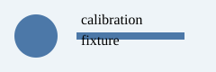

# Summary

This is a small synthetic report used solely for a local benchmark.

{ width=25% }

# Measurements

| Batch | Passing samples | Median score |
|:------|----------------:|-------------:|
| A     | 8               | 0.91         |
| B     | 7               | 0.88         |

# Interpretation

Both batches met the pre-specified synthetic threshold of 0.85.
